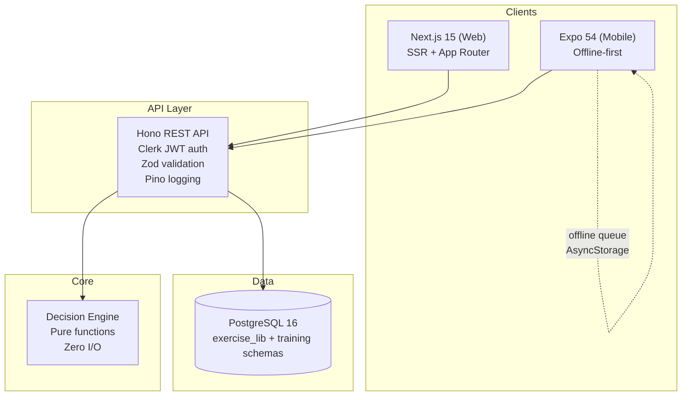
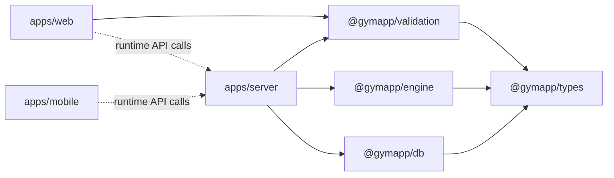

# Lifters Club

A training decision engine that turns workout history into justified next-week decisions. Not a workout tracker.

The system makes **7 types of training decisions** — load progression, volume adjustment, exercise rotation, deload recommendation, session recovery, missed session handling, and weekly plan generation — each with auditable reasoning stored alongside the result.

## Architecture



### Package Dependency Graph



`@gymapp/types` is the dependency leaf — depended on by everything, depends on nothing.

## Tech Stack

| Layer | Technology | Why |
|-------|-----------|-----|
| Monorepo | Turborepo + pnpm | Coordinated builds, caching, single lockfile ([ADR-0001](docs/adr/0001-monorepo-turborepo-pnpm.md)) |
| Backend | Hono | Ultrafast, TypeScript-first, middleware-based ([ADR-0003](docs/adr/0003-hono-backend.md)) |
| Web Frontend | Next.js 15 (App Router) | SSR, RSC, file-based routing |
| Mobile | Expo 54 + React Native | Cross-platform, OTA updates, Expo Router |
| Database | PostgreSQL 16 + Drizzle ORM | Separate schemas for exercise lib vs training data ([ADR-0002](docs/adr/0002-separate-postgres-schemas.md), [ADR-0004](docs/adr/0004-drizzle-orm.md)) |
| Validation | Zod | Runtime validation at all system boundaries, type inference |
| Auth | Clerk | JWT-based, works across web + mobile + server ([ADR-0006](docs/adr/0006-clerk-authentication.md)) |
| Styling | Tailwind + shadcn/ui (web), NativeWind (mobile) | Utility-first, consistent design system |
| Testing | Vitest | Jest-compatible, fast, monorepo-aware ([ADR-0007](docs/adr/0007-testing-strategy.md)) |
| Offline | AsyncStorage + offline queue | Simple mutation queue, auto-sync on reconnect ([ADR-0009](docs/adr/0009-simple-offline-queue.md)) |
| Observability | Pino (structured logging) + Sentry (error tracking) | JSON logs, request tracing, error capture |

## Monorepo Structure

```
lifters-club/
├── apps/
│   ├── web/                    # Next.js 15 dashboard (port 3000)
│   ├── mobile/                 # Expo 54 React Native app (port 8081)
│   └── server/                 # Hono REST API (port 4000)
├── packages/
│   ├── types/                  # @gymapp/types — domain type definitions (zero runtime)
│   ├── validation/             # @gymapp/validation — Zod schemas for all boundaries
│   ├── db/                     # @gymapp/db — Drizzle schema, client, migrations, seeds
│   └── engine/                 # @gymapp/engine — pure-function decision algorithms
├── docs/
│   ├── adr/                    # 9 Architecture Decision Records
│   └── *.md                    # Structured logging, Docker setup, user relationships
├── docker-compose.yml          # PostgreSQL + server + web (local dev)
├── docker-compose.test.yml     # Isolated test database
├── Makefile                    # Developer workflow shortcuts (run `make help`)
├── turbo.json                  # Turborepo task pipeline
└── pnpm-workspace.yaml         # Workspace configuration
```

Each app and package has its own README with architecture diagrams, ownership boundaries, extension patterns, and operational details.

## Quick Start

### Prerequisites

- Node.js 20+
- pnpm 10+ (`corepack enable && corepack prepare pnpm@10.28.0 --activate`)
- Docker (for PostgreSQL)

### Setup

```bash
# 1. Clone and install
git clone <repo-url> && cd lifters-club
pnpm install

# 2. Configure environment
cp .env.example .env
# Fill in: CLERK_SECRET_KEY, NEXT_PUBLIC_CLERK_PUBLISHABLE_KEY
# (get from https://dashboard.clerk.com)

# 3. Start database and seed
make up-db                     # Start PostgreSQL in Docker
pnpm db:push                   # Push schema (dev mode, no migrations)
pnpm db:seed:all               # Seed 140+ exercises + training programs

# 4. Start development servers
pnpm dev                       # Starts server (:4000) + web (:3000) via Turborepo

# 5. (Optional) Start mobile
pnpm mobile                    # Expo dev server (:8081)
pnpm mobile:ios                # iOS simulator
pnpm mobile:android            # Android emulator
```

### Verify

- API health: http://localhost:4000/health
- API docs (Swagger): http://localhost:4000/api/docs
- Web app: http://localhost:3000

## Key Commands

| Workflow | Command | What it does |
|----------|---------|-------------|
| **Dev** | `pnpm dev` | Start all dev servers (Turborepo) |
| | `make dev-server` | Server only (:4000) |
| | `make dev-web` | Web only (:3000) |
| | `make mobile` | Expo dev server |
| **Build** | `pnpm build` | Build all packages |
| | `pnpm typecheck` | Type-check everything |
| | `pnpm lint` | Lint everything |
| **Test** | `pnpm test` | Run all tests |
| | `make test-engine` | Engine tests only (90%+ coverage) |
| | `make test-server` | Server tests only |
| | `pnpm test:integration` | Spin up test DB, run integration suite, tear down |
| **Database** | `make up-db` | Start PostgreSQL |
| | `pnpm db:push` | Push schema changes (dev) |
| | `pnpm db:generate` | Generate migration SQL |
| | `pnpm db:migrate` | Run migrations (prod) |
| | `pnpm db:seed:all` | Seed exercises + programs |
| | `make studio` | Open Drizzle Studio GUI |
| | `make db-shell` | PostgreSQL shell |
| **Docker** | `make up` | Start all containers |
| | `make down` | Stop all containers |
| | `make reset` | Full reset: clean + reinstall + seed |

Run `make help` for the complete command reference.

## Two API Surfaces

The server exposes two distinct API surfaces:

| Surface | Auth | Purpose |
|---------|------|---------|
| **Exercise Library** (`/api/exercises/*`) | Public | Canonical movement database — list, search, filter, substitutions. Designed to be reusable independently. |
| **Training API** (`/api/users/*`, `/api/workouts/*`, `/api/programs/*`, `/api/decisions/*`, `/api/analytics/*`) | Clerk JWT | User-specific training data — programs, workouts, logs, decisions, analytics, weekly plans. |

API documentation is auto-generated via OpenAPI at `/api/docs`.

## Core Design: Functional Core, Imperative Shell

The decision engine (`@gymapp/engine`) contains **zero I/O**. Every function is pure:

```
Server service layer (I/O)     Engine (pure)                   Server service layer (I/O)
─────────────────────────  →   ─────────────────────────   →   ─────────────────────────
Fetch workout logs from DB     calculateLoadProgression()      Persist decision + reasoning
Fetch user preferences         → { increase, 107.5kg,          Return result to client
Fetch current program              "Hit 10 reps at RPE 7" }
```

Same input always produces the same output. The server's service layer handles all data fetching and persistence. This makes the engine trivially testable and the decision logic auditable.

## Documentation

| Document | Purpose |
|----------|---------|
| [CHANGELOG.md](CHANGELOG.md) | Notable changes by date — features, fixes, infra |
| [docs/PROJECT-STATUS.md](docs/PROJECT-STATUS.md) | Current state: what's built, how it fits together, what's wired vs incomplete |
| [docs/ROADMAP.md](docs/ROADMAP.md) | Prioritized backlog + banked plans (observability, decision engine, coaching gaps) |
| [docs/plans/](docs/plans/) | Detailed, signed-off implementation plans for in-flight / upcoming work |
| [ARCHITECTURE.md](ARCHITECTURE.md) | System overview, data flows, offline strategy, database design, API surface |
| [CLAUDE.md](CLAUDE.md) | Coding standards, SOLID principles, TypeScript conventions, testing strategy |
| [docs/adr/](docs/adr/) | 10 Architecture Decision Records (monorepo, schemas, ORM, auth, offline, testing, code quality, observability) |
| [apps/web/README.md](apps/web/README.md) | Web app: route map, patterns, auth flow, how to add pages |
| [apps/mobile/README.md](apps/mobile/README.md) | Mobile app: screen map, offline architecture, hooks, how to add screens |
| [apps/server/README.md](apps/server/README.md) | API server: middleware stack, route handlers, decision flow, how to add endpoints |
| [packages/types/README.md](packages/types/README.md) | Type system: module map, conventions, how to add types |
| [packages/db/README.md](packages/db/README.md) | Database: schema design, commands, migrations, how to modify schema |
| [packages/engine/README.md](packages/engine/README.md) | Decision engine: 7 core decisions + calibration, feedback-driven self-tuning, and athlete-constraint filtering; config pattern, how to add decisions |
| [packages/validation/README.md](packages/validation/README.md) | Validation: schema map, usage at API + form boundaries |
| [docs/DOCKER_SETUP.md](docs/DOCKER_SETUP.md) | Docker configuration and container setup |

## Project Conventions

- **Branch naming:** `feature/`, `fix/`, `refactor/`, `docs/`, `test/`, `chore/`
- **Commits:** `type(scope): description` — e.g., `feat(engine): add volume adjustment`
- **Types:** Strict TypeScript, no `any`, no `!` non-null assertions without justification
- **Validation:** Zod at all system boundaries, trust internal code
- **Testing:** Unit-heavy pyramid — 90%+ on engine, 80%+ on server, integration tests for critical flows

See [CLAUDE.md](CLAUDE.md) for the full coding standards reference.
