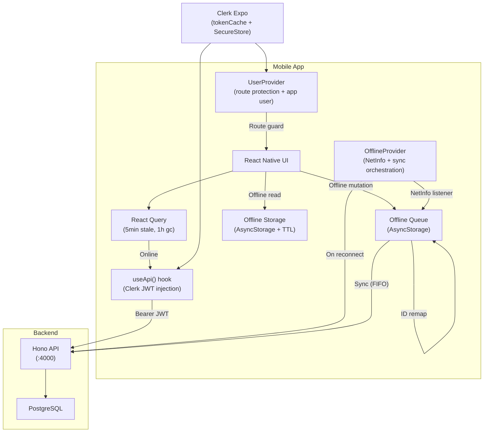

# @gymapp/mobile

Expo 54 React Native app with offline-first architecture for the Lifters Club training decision engine.

## What this is

A **React Native + Expo** mobile application with **offline-first** workout logging. This is one of two clients (alongside `@gymapp/web`) consuming the Hono REST API. Unlike the web app, the mobile app can operate without network connectivity -- workouts are logged locally and synced when the connection is restored.

Key capabilities:
- **Offline workout logging** with mutation queue and optimistic updates
- **Real-time sync** with automatic retry and ID remapping on reconnect
- **Rest timer**, readiness checks, and exercise decision badges during workouts
- **Exercise substitution** with local caching (24h TTL)

## Architecture



**Online path:** `useApi()` hook injects a fresh Clerk JWT per request via `api.withToken(token)`. React Query handles caching with 5-minute stale time.

**Offline path:** Mutations are serialized to `AsyncStorage` via the queue. Reads fall back to cached data. When `NetInfo` detects reconnection, `OfflineProvider` processes the queue in FIFO order, remapping offline IDs to server IDs as resources are created.

## Screen map

### Tab screens

| Screen | Route | Auth | Offline |
|--------|-------|------|---------|
| Home | `(tabs)/index` | Required | Cached data |
| Exercises | `(tabs)/exercises` | Required | Cached list |
| History | `(tabs)/history` | Required | Cached logs |
| Programs | `(tabs)/programs` | Required | Cached list |
| Profile | `(tabs)/profile` | Required | Cached user |

### Standalone screens

| Screen | Route | Auth | Offline |
|--------|-------|------|---------|
| Active Workout | `workout/[id]` | Required | Full offline logging |
| Exercise Info | `exercise-info/[exerciseId]` | Required | Cached detail |
| Exercise Alternatives | `exercise-alternatives/[exerciseId]` | Required | Cached substitutes (24h) |
| Workout Detail | `workout-detail/[logId]` | Required | Cached log |
| Onboarding | `onboarding` | Required | Online only |
| Settings | `settings` | Required | Cached preferences |
| Edit Profile | `edit-profile` | Required | Online only |

### Auth screens

| Screen | Route | Auth |
|--------|-------|------|
| Auth Landing | `(auth)/index` | None |
| Sign In | `(auth)/sign-in` | None |
| Sign Up | `(auth)/sign-up` | None |

## Directory structure

```
app/                            # Expo Router (file-based routing)
├── _layout.tsx                 # Root: ClerkProvider + QueryClient + OfflineProvider + UserProvider + ErrorBoundary
├── (auth)/                     # Unauthenticated screens
│   ├── _layout.tsx             #   Auth stack layout
│   ├── index.tsx               #   Auth landing
│   ├── sign-in.tsx             #   Clerk sign-in
│   └── sign-up.tsx             #   Clerk sign-up
├── (tabs)/                     # Main tab navigator
│   ├── _layout.tsx             #   Tab bar configuration
│   ├── index.tsx               #   Home (today's workout, summary)
│   ├── exercises.tsx           #   Exercise browser
│   ├── history.tsx             #   Workout history
│   ├── programs.tsx            #   Program list
│   └── profile.tsx             #   User profile
├── workout/[id].tsx            # Active workout (modal, offline-capable)
├── exercise-info/[exerciseId].tsx      # Exercise detail (modal)
├── exercise-alternatives/[exerciseId].tsx  # Substitution picker (modal)
├── workout-detail/[logId].tsx  # Completed workout detail (modal)
├── onboarding.tsx              # New user setup
├── settings.tsx                # App settings (modal)
└── edit-profile.tsx            # Profile editor (modal)
components/
├── ErrorBoundary.tsx           # App-wide error boundary (wraps InitialLayout)
├── OfflineIndicator.tsx        # Network status banner
├── AlternativeExerciseCard.tsx # Substitute exercise card
├── ExerciseActionsSheet.tsx    # Exercise action sheet (swap, info)
├── ExerciseProgressChart.tsx   # SVG exercise progress chart
├── VolumeChart.tsx             # SVG volume chart
├── workout/                    # Workout sub-components
│   ├── DecisionBadge.tsx       #   Decision confidence badge
│   └── DecisionExplanationModal.tsx  # Decision reasoning modal
├── __tests__/                  # Component tests
└── index.ts                    # Barrel exports
hooks/
├── use-api.ts                  # Auth-wrapped API hook (mirrors web pattern)
├── use-workout-offline.ts      # Offline workout orchestration (optimistic updates + queue)
├── use-rest-timer.ts           # Rest timer with countdown
├── use-readiness-check.ts      # Pre-workout readiness survey
├── use-exercise-decisions.ts   # Decision fetching per exercise
├── use-workout-completion.ts   # Workout completion with undo support
└── index.ts                    # Barrel exports
lib/
├── api.ts                      # ApiClient class (mirrors web, adds rawRequest for sync)
├── constants.ts                # API_URL, COLORS, labels, thresholds
├── clerk.ts                    # Clerk tokenCache with SecureStore
├── clerk-error.ts              # Type-safe Clerk error extraction
├── fetch-with-timeout.ts       # Fetch wrapper with configurable timeout (30s default)
├── toast.ts                    # Cross-platform toast utility
└── offline/
    ├── queue.ts                # Mutation queue (enqueue, dequeue, dedup, ID mapping)
    ├── storage.ts              # AsyncStorage helpers (workout cache, exercise cache, TTL)
    └── index.ts                # Barrel exports
providers/
├── user-provider.tsx           # App user state + Expo Router route protection
└── offline-provider.tsx        # NetInfo monitoring + queue sync orchestration
types/
└── index.ts                    # App-specific types (ExercisePreference, etc.)
utils/
└── debounce.ts                 # Debounce utility
```

## Key patterns

### API client

The mobile `ApiClient` (`lib/api.ts`) mirrors the web pattern: a class with `withToken()` for scoped auth. It additionally exposes `rawRequest()` for the offline provider's dynamic endpoint construction during sync.

```
lib/api.ts        -->  ApiClient class, exported as `api` singleton
hooks/use-api.ts  -->  useApi() hook for components (injects fresh Clerk JWT)
```

**In components**, use the hook:

```tsx
const api = useApi();
const { data } = await api.getTodaysWorkout();
```

**In providers** (which can't use hooks in callbacks), use `api.withToken(token)` directly:

```tsx
const token = await getToken();
const response = await api.withToken(token).getCurrentUser();
```

### Offline architecture

The offline system has three layers:

1. **`offline/queue.ts`** -- Serialized mutation queue stored in AsyncStorage. Supports six operation types: `CREATE_WORKOUT_LOG`, `UPDATE_WORKOUT_LOG`, `CREATE_LOGGED_SET`, `UPDATE_LOGGED_SET`, `DELETE_LOGGED_SET`, `RECORD_DECISION_OUTCOME`. Includes deduplication (won't queue the same CREATE twice) and ID mapping (`idMappingStore`) to remap offline IDs to server IDs after sync.

2. **`offline/storage.ts`** -- Read cache for workouts, exercises, and substitutes. Substitutes use a 24-hour TTL. Exercise preferences are persisted for the "Remember My Choice" feature.

3. **`providers/offline-provider.tsx`** -- Orchestrates sync. Listens to `NetInfo` for connectivity changes. On reconnect, acquires a sync lock (5-minute stale detection), processes the queue in FIFO order, remaps IDs as resources are created, and retries up to 3 times per item. Handles 409 Conflict gracefully (resource already exists).

**`hooks/use-workout-offline.ts`** ties it together for the workout screen -- optimistic local updates with queue fallback when offline.

### Auth and routing

- **Clerk Expo** handles authentication with `SecureStore`-backed token caching (`lib/clerk.ts`).
- **`UserProvider`** fetches the app user from `/api/users/me` once after sign-in and manages Expo Router navigation guards:
  - Unauthenticated users go to `(auth)/`
  - Authenticated users without an app user go to `onboarding`
  - Authenticated users with an app user go to `(tabs)/`
- **`ErrorBoundary`** wraps `InitialLayout` to catch render errors app-wide.

### Provider hierarchy

```
ClerkProvider
  └── QueryClientProvider
        └── OfflineProvider      (NetInfo + sync)
              └── UserProvider   (app user + route guard)
                    └── ErrorBoundary
                          └── InitialLayout (Stack navigator)
```

## How to add a new screen

1. Create a file in `app/` following Expo Router conventions (e.g., `app/my-screen.tsx` or `app/my-feature/[id].tsx`).
2. Register it in `app/_layout.tsx` as a `Stack.Screen` with presentation options.
3. Use `useApi()` for data fetching.
4. Handle offline:
   - **Reads**: Check `offlineStorage` first, fall back to API, cache the result.
   - **Mutations**: If online, call API directly. If offline, enqueue via `offlineQueue.enqueue()`.
5. Run `pnpm --filter @gymapp/mobile typecheck` to verify.

## Development

```bash
# Start Expo dev server
pnpm mobile

# iOS simulator
pnpm mobile:ios

# Android emulator
pnpm mobile:android

# Requires the Hono API running on :4000
pnpm --filter @gymapp/server dev
```

For physical device testing, set `EXPO_PUBLIC_API_URL` to your machine's local IP (e.g., `http://192.168.1.100:4000`).

## Environment variables

| Variable | Required | Description |
|----------|----------|-------------|
| `EXPO_PUBLIC_CLERK_PUBLISHABLE_KEY` | Yes | Clerk frontend key (Expo public prefix) |
| `EXPO_PUBLIC_API_URL` | Yes | API URL (e.g., `http://localhost:4000`) |

## Testing

```bash
# Run tests
pnpm --filter @gymapp/mobile test

# Watch mode
pnpm --filter @gymapp/mobile test:watch

# Coverage
pnpm --filter @gymapp/mobile test:coverage

# Type check
pnpm --filter @gymapp/mobile typecheck
```

Tests use **Jest + jest-expo** with **@testing-library/react-native** for component tests.

See `TESTING.md` and `TESTING_SETUP_INSTRUCTIONS.md` in the mobile app root for detailed testing guidance.

## Further reading

- [CLAUDE.md](../../CLAUDE.md) -- Full coding standards, SOLID principles, and review checklist
- [Structured Logging](../../docs/structured-logging.md) -- Logging conventions
- [Architecture Decision Records](../../docs/adr/) -- Key design decisions
- [Mobile Testing Guide](./TESTING.md) -- Testing standards for the mobile app
