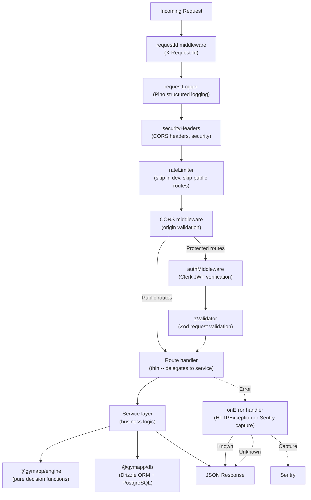

# @gymapp/server

Hono REST API backend for the Lifters Club training decision engine.

## What this is

A **Hono REST API** serving both the web and mobile clients. The API exposes two surfaces:

1. **Public Exercise Library** -- Browsable exercise database with substitution scoring. No auth required.
2. **Authenticated Training API** -- User management, programs, workouts, logging, decisions, and analytics. Requires Clerk JWT.

The server integrates the `@gymapp/engine` package for pure-function training decisions (load progression, volume adjustment, deload checks, etc.) and persists all decisions for outcome tracking.

Swagger documentation is available at `/api/docs`.

## Request lifecycle



## API surface

### Public endpoints (no auth)

| Method | Endpoint | Description |
|--------|----------|-------------|
| `GET` | `/health` | Health check |
| `GET` | `/` | API info + docs link |
| `GET` | `/api/docs` | Swagger UI |
| `GET` | `/api/openapi.json` | OpenAPI spec |
| `GET` | `/api/exercises` | List exercises (paginated, filterable) |
| `GET` | `/api/exercises/:id` | Get exercise by ID |
| `GET` | `/api/exercises/search/:term` | Search exercises by name/alias |
| `GET` | `/api/exercises/:id/substitutes` | Get scored substitutes |
| `GET` | `/api/exercises/movement-patterns` | List movement patterns |
| `GET` | `/api/exercises/equipment` | List equipment types |
| `GET` | `/api/exercises/muscles` | List muscle groups |
| `GET` | `/api/programs` | List training programs |
| `GET` | `/api/programs/:id` | Get program by ID |

### Authenticated endpoints (Bearer JWT required)

#### Users

| Method | Endpoint | Description |
|--------|----------|-------------|
| `GET` | `/api/users/me` | Get current user (by Clerk ID from JWT) |
| `GET` | `/api/users/:id` | Get user by app ID |
| `POST` | `/api/users` | Create new user (onboarding) |
| `PATCH` | `/api/users/:id` | Update user profile |
| `POST` | `/api/users/readiness/extended` | Submit extended readiness check |
| `POST` | `/api/users/readiness` | Submit basic readiness check |
| `GET` | `/api/users/:id/baselines` | Get user exercise baselines |
| `POST` | `/api/users/:id/baselines` | Save exercise baselines |
| `GET` | `/api/users/:id/calibration-plan` | Get calibration plan |
| `PATCH` | `/api/users/:id/onboarding` | Update onboarding status |

#### Programs (authenticated management)

| Method | Endpoint | Description |
|--------|----------|-------------|
| `POST` | `/api/programs` | Create program |
| `PATCH` | `/api/programs/:id` | Update program |
| `DELETE` | `/api/programs/:id` | Delete program |

#### Training blocks

| Method | Endpoint | Description |
|--------|----------|-------------|
| `GET` | `/api/workouts/training-blocks` | List user's training blocks |
| `GET` | `/api/workouts/training-blocks/:id` | Get training block with program |
| `POST` | `/api/workouts/training-blocks` | Create training block |
| `PATCH` | `/api/workouts/training-blocks/:id` | Update training block (pause/resume) |
| `POST` | `/api/workouts/training-blocks/:id/generate-week` | Generate next week of workouts |

#### Workouts

| Method | Endpoint | Description |
|--------|----------|-------------|
| `GET` | `/api/workouts/today` | Get today's workout with decisions |
| `GET` | `/api/workouts/recent` | Get recent workouts |
| `GET` | `/api/workouts` | List workouts (filterable) |
| `GET` | `/api/workouts/:id` | Get workout by ID |
| `PATCH` | `/api/workouts/:id` | Update workout |
| `POST` | `/api/workouts/:id/start` | Start a workout |
| `POST` | `/api/workouts/:id/complete` | Complete a workout |
| `POST` | `/api/workouts/:id/skip` | Skip a workout |

#### Workout logs

| Method | Endpoint | Description |
|--------|----------|-------------|
| `GET` | `/api/logs` | List workout logs |
| `GET` | `/api/logs/:id` | Get log with sets |
| `POST` | `/api/logs` | Create workout log |
| `PATCH` | `/api/logs/:id/complete` | Complete a workout log |
| `POST` | `/api/logs/retrospective` | Log a past workout |
| `GET` | `/api/logs/:logId/sets` | List sets for a log |
| `POST` | `/api/logs/:logId/sets` | Add a set |
| `PATCH` | `/api/logs/:logId/sets/:setId` | Update a set |
| `DELETE` | `/api/logs/:logId/sets/:setId` | Delete a set |

#### Decisions (engine)

| Method | Endpoint | Description |
|--------|----------|-------------|
| `POST` | `/api/decisions/load-progression` | Calculate load progression |
| `POST` | `/api/decisions/volume` | Calculate volume adjustment |
| `POST` | `/api/decisions/deload` | Check deload need |
| `POST` | `/api/decisions/rotation` | Check exercise rotation |
| `POST` | `/api/decisions/recovery` | Calculate session recovery |
| `POST` | `/api/decisions/missed-session` | Handle missed session |
| `POST` | `/api/decisions/weekly-plan` | Generate weekly plan |
| `POST` | `/api/decisions/performance-trend` | Calculate performance trend |
| `GET` | `/api/decisions/history` | Get decision history |
| `GET` | `/api/decisions/:id` | Get single decision |
| `POST` | `/api/decisions/:id/outcome` | Record decision outcome |
| `PATCH` | `/api/decisions/:id/outcome` | Evaluate outcome success |
| `GET` | `/api/decisions/accuracy` | Get decision accuracy stats |
| `GET` | `/api/decisions/pending-evaluation` | Get decisions pending evaluation |

#### Analytics

| Method | Endpoint | Description |
|--------|----------|-------------|
| `GET` | `/api/analytics/summary` | Overall training summary |
| `GET` | `/api/analytics/volume` | Weekly volume data |
| `GET` | `/api/analytics/personal-records` | Personal records per exercise |
| `GET` | `/api/analytics/weekly-summary` | Detailed weekly summary |
| `GET` | `/api/analytics/exercise/:id/progress` | Exercise progress over time |

## Middleware stack

Middleware is applied in this order (defined in `src/index.ts`):

| Order | Middleware | File | Purpose |
|-------|-----------|------|---------|
| 1 | `requestId` | `middleware/security-headers.ts` | Generates `X-Request-Id` for distributed tracing |
| 2 | `requestLogger` | `middleware/request-logger.ts` | Pino structured logging with request context |
| 3 | `securityHeaders` | `middleware/security-headers.ts` | Security response headers |
| 4 | `rateLimiter` | `middleware/rate-limit.ts` | Rate limiting (skipped in dev; public routes get higher limits) |
| 5 | `cors` | Hono built-in | CORS with configurable origins (open in dev) |
| 6 | `authMiddleware` | `middleware/auth.ts` | Clerk JWT verification (protected routes only) |
| 7 | `zValidator` | Per-route | Zod request validation (query, params, body) |

## Directory structure

```
src/
├── index.ts                # App entry: middleware chain, error handler, graceful shutdown
├── config.ts               # Zod-validated env config (fails fast on missing vars)
├── types.ts                # Hono Env type (requestId, userId, clerkId, logger)
├── constants.ts            # Business constants (thresholds, limits)
├── openapi.ts              # Route registration, auth middleware mounting, Swagger UI
├── openapi-spec.ts         # OpenAPI JSON spec
├── middleware/
│   ├── auth.ts             # Clerk JWT verification (authMiddleware + optionalAuthMiddleware)
│   ├── authorize.ts        # Resource ownership checks (getAuthenticatedUserFromContext)
│   ├── rate-limit.ts       # Token bucket rate limiter (100/min default, 200/min public)
│   ├── request-logger.ts   # Pino child logger with request context
│   └── security-headers.ts # X-Request-Id generation, security headers
├── routes/                 # Route handlers (thin -- delegate to services)
│   ├── exercises.ts        # Exercise CRUD + search + substitutes
│   ├── programs.ts         # Program CRUD
│   ├── workouts.ts         # Training blocks + workout management
│   ├── logs.ts             # Workout log CRUD + set management
│   ├── decisions.ts        # Decision engine endpoints + outcome tracking
│   ├── analytics.ts        # Training analytics + personal records
│   ├── users.ts            # User profile + readiness + baselines + calibration
│   ├── notifications.ts    # Notification endpoints
│   ├── templates.ts        # Workout templates
│   ├── standalone-workouts.ts  # Non-program workouts
│   └── weekly-plans.ts     # Weekly plan endpoints
├── services/
│   ├── decision-eval.ts    # Decision outcome evaluation logic
│   ├── week-generation.ts  # Week generation orchestration
│   └── workout-generation.ts # Workout generation from templates
└── lib/
    ├── auth.ts             # User access verification helpers
    ├── logger.ts           # Pino logger setup (JSON in prod, pretty in dev)
    ├── sentry.ts           # Sentry init, captureError, flush
    └── patch-utils.ts      # PATCH request field extraction utility
```

## Key patterns

### Routes are thin

Route handlers validate input and return responses. Business logic lives in services. Engine computations live in `@gymapp/engine` (pure functions, no I/O).

```
Route handler  -->  zValidator (input)  -->  service (logic)  -->  engine (computation)
                                             |
                                             v
                                          @gymapp/db (persistence)
```

### Auth and ownership

- `middleware/auth.ts` verifies the Clerk JWT and sets `c.set("userId", payload.sub)` and `c.set("clerkId", payload.sub)` in context.
- `middleware/authorize.ts` provides `getAuthenticatedUserFromContext()` which resolves the Clerk ID to the app user and verifies resource ownership.
- Routes that accept a `userId` query parameter verify it matches the authenticated user (preventing horizontal privilege escalation).

### Decision flow

1. Client sends decision request (e.g., `POST /api/decisions/load-progression`)
2. Route validates input with Zod
3. Route calls `@gymapp/engine` pure function (e.g., `calculateLoadProgression()`)
4. Result is persisted to `decisions` table with algorithm version
5. Result is returned to client
6. Later, client records outcome (`POST /api/decisions/:id/outcome`)
7. Outcomes can be evaluated for accuracy (`GET /api/decisions/accuracy`)

### Error handling

- **Known errors**: `HTTPException` subclasses return structured JSON with appropriate status codes.
- **Unknown errors**: Captured by `app.onError()`, logged with Pino, sent to Sentry, and return a generic 500 (no internal details leaked).
- **Validation errors**: Caught by `zValidator` middleware, return 400 with field-level details.
- All error responses include `requestId` for tracing.

## How to add a new endpoint

1. Create or extend a route file in `src/routes/`.
2. Define Zod schemas for request validation (query, params, body).
3. Use `zValidator()` middleware for automatic validation.
4. Add a service function in `src/services/` if the logic is non-trivial.
5. If using shared types, add them to `@gymapp/types` or `@gymapp/validation`.
6. Mount the route in `src/openapi.ts` with appropriate auth middleware.
7. Write integration tests using Hono's test client.
8. Run `pnpm --filter @gymapp/server typecheck` to verify.

## Development

```bash
# Start the dev server (port 4000, tsx hot reload)
pnpm --filter @gymapp/server dev

# This loads env from root .env via --env-file flag
```

## Environment variables

| Variable | Required | Default | Description |
|----------|----------|---------|-------------|
| `DATABASE_URL` | Yes | -- | PostgreSQL connection string |
| `CLERK_SECRET_KEY` | Yes | -- | Clerk backend secret key |
| `PORT` | No | `4000` | Server port |
| `NODE_ENV` | No | `development` | Environment (`development`, `production`, `test`) |
| `CORS_ORIGINS` | No | (see below) | Comma-separated allowed origins |
| `RATE_LIMIT_MAX` | No | `100` | Max requests per window |
| `RATE_LIMIT_WINDOW_MS` | No | `60000` | Rate limit window in ms |
| `SENTRY_DSN` | No | -- | Sentry error tracking DSN |

**CORS defaults:** In development, all origins are allowed. In production, defaults to `theliftersclub.com` and `lifters-club.vercel.app`.

Environment config is Zod-validated at startup (`src/config.ts`). The server will fail fast with clear error messages if required variables are missing.

## Testing

```bash
# Unit tests
pnpm --filter @gymapp/server test

# Integration tests (spins up Docker test DB)
pnpm test:integration
```

Integration tests use `docker-compose.test.yml` with a dedicated test database on port 5433.

## Observability

- **Structured logging**: Pino with JSON output in production, pretty-printed in development. Every log line includes `requestId` and `userId` (when authenticated). See `../../docs/structured-logging.md`.
- **Error tracking**: Sentry captures unhandled errors with request context. Sentry is flushed on graceful shutdown.
- **Request tracing**: Every request gets a unique `X-Request-Id` header, propagated through logs and error responses.
- **Graceful shutdown**: SIGTERM/SIGINT handlers flush Sentry, close the database pool, and allow in-flight requests to complete.

## Further reading

- [CLAUDE.md](../../CLAUDE.md) -- Full coding standards, SOLID principles, and review checklist
- [Structured Logging](../../docs/structured-logging.md) -- Logging conventions and guidelines
- [Architecture Decision Records](../../docs/adr/) -- Key design decisions
