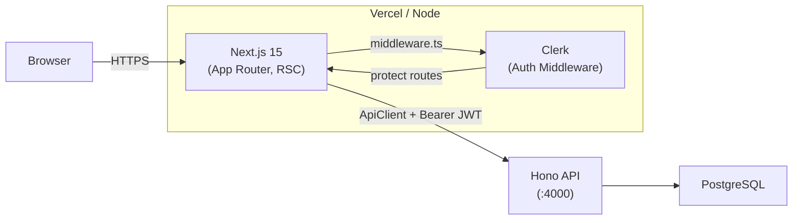

# @gymapp/web

Next.js 15 dashboard for the Lifters Club training decision engine.

## What this is

A server-rendered web application built with **Next.js 15 (App Router, React Server Components)** using **Tailwind CSS + shadcn/ui** for styling and **Clerk** for authentication. This is one of two clients (alongside `@gymapp/mobile`) that consume the Hono REST API. The web app is **online-only** -- offline workout logging is handled exclusively by the mobile app.

## Architecture



**Key architectural decisions:**
- Clerk middleware intercepts all non-public routes and enforces authentication before page rendering.
- The `ApiClient` class (`lib/api.ts`) is the single point of contact with the backend. Client components use the `useApi()` hook which injects a fresh Clerk JWT per request.
- `UserProvider` bridges Clerk auth state with the app's user model by fetching `/api/users/me` on load.

## Route map

### Public routes

| Route | Description | Auth |
|-------|-------------|------|
| `/` | Marketing landing page | None |
| `/exercises` | Exercise library browser | None |
| `/exercises/[id]` | Exercise detail page | None |
| `/sign-in` | Clerk sign-in | None |
| `/sign-up` | Clerk sign-up | None |

### Protected routes (`/(app)/*`)

| Route | Description | Auth |
|-------|-------------|------|
| `/dashboard` | Training overview, today's workout, recent workouts | Clerk JWT |
| `/programs` | Browse and manage training programs | Clerk JWT |
| `/programs/[id]` | Program detail with exercise editor | Clerk JWT |
| `/history` | Workout log history with filters and analytics | Clerk JWT |
| `/analytics` | Strength progress, volume charts, personal records | Clerk JWT |
| `/decisions` | Decision engine history and outcomes | Clerk JWT |
| `/settings` | User profile and preferences | Clerk JWT |
| `/onboarding` | New user setup flow | Clerk JWT |

All `/(app)/*` routes are wrapped with `OnboardingGuard`, which redirects users who haven't completed onboarding.

## Directory structure

```
src/
├── app/                          # Next.js App Router pages
│   ├── (marketing)/              # Public landing page
│   │   ├── layout.tsx            #   Marketing layout (nav + footer)
│   │   └── page.tsx              #   Landing page
│   ├── exercises/                # Public exercise library
│   │   ├── page.tsx              #   Exercise list with filters
│   │   └── [id]/page.tsx         #   Exercise detail
│   ├── (app)/                    # Protected routes (auth required)
│   │   ├── layout.tsx            #   OnboardingGuard + DashboardLayout
│   │   ├── dashboard/page.tsx    #   Training overview
│   │   ├── programs/             #   Program management
│   │   ├── history/page.tsx      #   Workout history + analytics
│   │   ├── analytics/page.tsx    #   Charts and trends
│   │   ├── decisions/            #   Decision engine UI
│   │   ├── settings/page.tsx     #   User settings
│   │   └── onboarding/page.tsx   #   New user onboarding
│   ├── sign-in/                  # Clerk sign-in page
│   ├── sign-up/                  # Clerk sign-up page
│   ├── layout.tsx                # Root: ClerkProvider + UserProvider + Toaster
│   └── error.tsx                 # Global error boundary
├── components/
│   ├── ui/                       # shadcn/ui base components (Button, Card, Dialog, etc.)
│   ├── layout/                   # Navigation, sidebar, mobile nav, onboarding guard
│   │   ├── dashboard-layout.tsx  #   Sidebar + main content area
│   │   ├── sidebar.tsx           #   Desktop sidebar navigation
│   │   ├── mobile-nav.tsx        #   Mobile bottom navigation
│   │   └── onboarding-guard.tsx  #   Redirect if onboarding incomplete
│   ├── dashboard/                # Dashboard cards and widgets
│   │   ├── todays-workout-card   #   Current workout display
│   │   ├── recent-workouts-card  #   Recent workout list
│   │   └── weekly-summary.tsx    #   Weekly training summary
│   ├── programs/                 # Program management UI
│   │   ├── program-card.tsx      #   Program overview card
│   │   ├── exercise-editor.tsx   #   Edit exercises in a program
│   │   ├── add-exercise-dialog   #   Add exercise to program
│   │   └── exercise-alternatives-dialog  # Substitute exercises
│   ├── history/                  # Workout log viewing
│   │   ├── log-workout-dialog    #   Retrospective workout logging
│   │   ├── workout-drawer.tsx    #   Workout detail side panel
│   │   ├── analytics-section     #   Inline analytics
│   │   └── export-dialog.tsx     #   Export workout data
│   ├── charts/                   # Strength/volume charts (Recharts)
│   │   ├── strength-progress     #   Weight over time
│   │   ├── volume-chart.tsx      #   Weekly volume
│   │   ├── rpe-trends-chart      #   RPE trends
│   │   ├── frequency-heatmap     #   Training frequency
│   │   └── personal-records      #   PR tracking
│   ├── decisions/                # Decision display components
│   │   ├── decision-card.tsx     #   Decision summary card
│   │   ├── decision-detail.tsx   #   Full decision reasoning
│   │   └── override-reason-picker #  Override reason selection
│   └── marketing/                # Landing page components
├── lib/
│   ├── api.ts                    # Centralized ApiClient class (all API calls)
│   ├── use-api.ts                # Auth-wrapped React hook for components
│   ├── constants.ts              # App constants
│   ├── fetch-timeout.ts          # Request timeout utility
│   └── utils.ts                  # Tailwind cn() helper
├── providers/
│   └── user-provider.tsx         # Auth state + app user context
└── middleware.ts                  # Clerk auth middleware (route protection)
```

## Key patterns

### API client

All server communication goes through a single `ApiClient` class in `lib/api.ts`. This class handles request construction, auth headers, error parsing, and response validation (Zod schemas for critical responses).

```
lib/api.ts       -->  ApiClient class, exported as `api` singleton
lib/use-api.ts   -->  useApi() hook, wraps protected methods with fresh Clerk JWT
```

**In client components**, always use the hook:

```tsx
const api = useApi();
const { data } = await api.getDecisionHistory({ userId, limit: 20 });
```

**In providers** (which can't use hooks in callbacks), use `api.withToken(token)` directly. Never use raw `fetch()`.

### Auth flow

1. `middleware.ts` uses `clerkMiddleware` to protect all routes except `/`, `/sign-in`, `/sign-up`, and `/exercises`.
2. Root `layout.tsx` wraps the app in `ClerkProvider` + `UserProvider`.
3. `UserProvider` fetches the app-level user from `/api/users/me` using the Clerk JWT.
4. `OnboardingGuard` (in `(app)/layout.tsx`) redirects users without an app user record to `/onboarding`.

### Component organization

- **`components/ui/`** -- shadcn/ui primitives. Do not add business logic here.
- **`components/{feature}/`** -- Feature-specific components (dashboard, programs, history, etc.). Each feature directory has an `index.ts` barrel export.
- **Error/loading boundaries** -- Each `(app)/{page}/` directory includes `error.tsx` and `loading.tsx` for Next.js streaming/error handling.

## How to add a new page

1. Create `src/app/(app)/my-page/page.tsx` (protected) or `src/app/my-page/page.tsx` (public).
2. Add `error.tsx` and `loading.tsx` siblings for error/loading states.
3. Add a navigation link in `components/layout/sidebar.tsx` and `components/layout/mobile-nav.tsx`.
4. Use `const api = useApi()` in client components for data fetching.
5. If the page needs new API calls, add methods to `ApiClient` in `lib/api.ts` and expose them in `lib/use-api.ts`.
6. Run `pnpm --filter @gymapp/web typecheck` to verify.

## Development

```bash
# Start the dev server (port 3000)
pnpm --filter @gymapp/web dev

# Requires the Hono API running on :4000
pnpm --filter @gymapp/server dev
```

## Environment variables

| Variable | Required | Description |
|----------|----------|-------------|
| `NEXT_PUBLIC_CLERK_PUBLISHABLE_KEY` | Yes | Clerk frontend key |
| `NEXT_PUBLIC_API_URL` | Yes | Public API URL (e.g., `http://localhost:4000`) |
| `API_URL_INTERNAL` | No | Internal API URL for SSR in Docker (e.g., `http://server:4000`) |

These are loaded from the root `.env` file.

## Quality checks

```bash
pnpm --filter @gymapp/web lint        # ESLint
pnpm --filter @gymapp/web typecheck   # TypeScript strict mode
pnpm --filter @gymapp/web build       # Production build
```

## Further reading

- [CLAUDE.md](../../CLAUDE.md) -- Full coding standards, SOLID principles, and review checklist
- [Structured Logging](../../docs/structured-logging.md) -- Logging conventions
- [Architecture Decision Records](../../docs/adr/) -- Key design decisions
