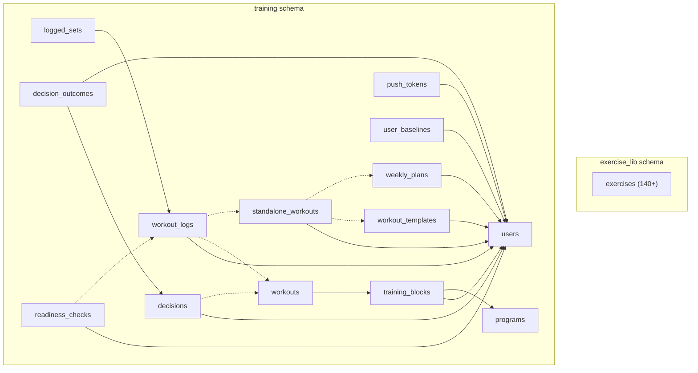

# @gymapp/db

Drizzle ORM layer for the Lifters Club monorepo. Owns the PostgreSQL schema definitions, database client, migrations, and seed data.

## Purpose

This package provides:
- Drizzle schema definitions mapping to PostgreSQL tables
- A lazily-initialized, connection-pooled database client
- Migration generation and execution via Drizzle Kit
- Seed scripts for the exercise library (140+ exercises) and training programs

## Ownership Boundary

| Owns | Does NOT own |
|------|-------------|
| PostgreSQL schema (tables, columns, indexes, FKs) | Business logic (`@gymapp/engine`) |
| Database client and connection pooling | Input validation (`@gymapp/validation`) |
| Migration files and seed data | API route definitions (`apps/server`) |
| Query interface (Drizzle ORM) | Domain type definitions (`@gymapp/types`) |

## Database Design

Two separate PostgreSQL schemas in one database, per [ADR-0002](../../docs/adr/0002-separate-postgres-schemas.md):



**Why separate schemas?** The exercise library is a standalone, reusable reference database. The training schema contains user-specific, application-level data. This separation allows the exercise library to be consumed independently.

## Key Files

| File | Purpose |
|------|---------|
| `src/schema/exercise-lib.ts` | `exercise_lib.exercises` table definition |
| `src/schema/training.ts` | All `training.*` table definitions (users, programs, workouts, logs, decisions, baselines, templates, etc.) |
| `src/schema/index.ts` | Barrel re-export of both schemas |
| `src/client.ts` | Lazy-init Drizzle client with connection pooling (max 20, idle timeout 30s) |
| `src/index.ts` | Public exports: `db`, `closeDb`, and all schema tables |
| `src/seed.ts` | Seeds 140+ exercises into `exercise_lib.exercises` |
| `src/seed-programs.ts` | Seeds training programs (e.g., Progressive PPL From HELL) |

## Commands

| Command | What it does | When to use |
|---------|-------------|-------------|
| `pnpm --filter @gymapp/db db:generate` | Generate SQL migration from schema changes | After modifying schema files |
| `pnpm --filter @gymapp/db db:migrate` | Run pending migrations | Production deployments |
| `pnpm --filter @gymapp/db db:push` | Push schema directly (skips migration files) | Local development |
| `pnpm --filter @gymapp/db db:seed` | Seed exercise library (140+ exercises) | Fresh database setup |
| `pnpm --filter @gymapp/db db:seed:programs` | Seed training programs | After exercise seed |
| `pnpm --filter @gymapp/db db:seed:all` | Run both seed scripts sequentially | Full database reset |
| `pnpm --filter @gymapp/db db:studio` | Open Drizzle Studio GUI | Inspect data visually |

## How to Modify the Schema

1. Edit the relevant schema file (`src/schema/exercise-lib.ts` or `src/schema/training.ts`)
2. Run `pnpm --filter @gymapp/db db:generate` to create a migration
3. Review the generated SQL in the `migrations/` directory
4. Apply: `db:push` for local dev, `db:migrate` for production
5. If the change affects domain types, update `@gymapp/types` to match

**Safe changes** (no data loss): adding nullable columns, adding tables, adding indexes, widening varchar length.

**Unsafe changes** (require migration planning): dropping columns/tables, renaming, changing column types, adding NOT NULL to existing columns.

## Column Conventions

| Layer | Convention | Example |
|-------|-----------|---------|
| Database columns | `snake_case` | `created_at`, `training_level`, `primary_muscles` |
| TypeScript properties | `camelCase` | `createdAt`, `trainingLevel`, `primaryMuscles` |

Drizzle maps between them automatically via the column name parameter: `createdAt: timestamp("created_at")`.

## Import Patterns

```typescript
// Import the database client
import { db, closeDb } from "@gymapp/db";

// Import schema tables for queries
import { exercises } from "@gymapp/db/schema";
import { users, workoutLogs, loggedSets } from "@gymapp/db/schema";

// Drizzle operators
import { eq, and, desc, sql } from "drizzle-orm";
```

## Environment

| Variable | Required | Description |
|----------|----------|-------------|
| `DATABASE_URL` | Yes | PostgreSQL connection string |

The seed scripts fall back to `../../.env` if `DATABASE_URL` is not in the process environment.

## Further Reading

- [CLAUDE.md](../../CLAUDE.md) -- full monorepo coding standards
- [packages/db/CLAUDE.md](./CLAUDE.md) -- package-specific DB guidelines and query patterns
- [ADR-0002: Separate PostgreSQL Schemas](../../docs/adr/0002-separate-postgres-schemas.md)
- [ADR-0004: Drizzle ORM](../../docs/adr/0004-drizzle-orm.md)
- [Drizzle ORM Documentation](https://orm.drizzle.team/docs/overview)
