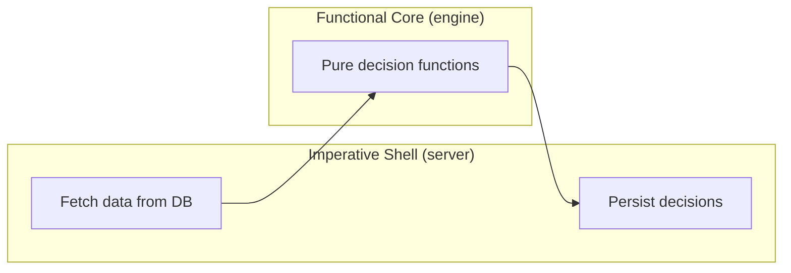

# @gymapp/engine

Pure-function decision engine -- the core business logic of Lifters Club. Takes training data in, returns justified decisions out. No I/O, no side effects, no database calls.

## Purpose

This package implements 7 decision types plus supporting utility functions that together form the "training brain" of the application. Every function is pure: same input always produces same output, with no external dependencies beyond `@gymapp/types`.

## Ownership Boundary

| Owns | Does NOT own |
|------|-------------|
| Progression/volume/rotation/deload algorithms | Data fetching or persistence (`@gymapp/db`) |
| Decision thresholds and configuration | API route definitions (`apps/server`) |
| 1RM estimation and calibration logic | Input validation (`@gymapp/validation`) |
| Substitution scoring | User-facing presentation or formatting |

## Core Design Principle

**Functional core, imperative shell.** The engine is the functional core -- pure functions that transform data. The server service layer is the imperative shell -- it fetches data from the database, calls engine functions, and persists results.



## Decision Functions

| Function | File | Input | Output | Purpose |
|----------|------|-------|--------|---------|
| `calculateLoadProgression` | `progression.ts` | `ProgressionInput` | `LoadDecision` | Weight up/down/maintain based on rep performance and RPE |
| `calculateVolumeAdjustment` | `volume.ts` | `VolumeInput` | `VolumeDecision` | Add/maintain/reduce sets based on completion rate and RPE |
| `calculateExerciseRotation` | `rotation.ts` | `RotationInput` | `RotationDecision` | Keep or swap exercise based on time-on and performance trend |
| `calculateDeloadNeed` | `deload.ts` | `DeloadInput` | `DeloadDecision` | Recommend recovery weeks based on fatigue accumulation |
| `calculateSessionRecovery` | `recovery.ts` | `RecoveryInput` | `RecoveryDecision` | Adjust intensity/volume for poor recovery days |
| `calculateMissedSessionHandling` | `missed-session.ts` | `MissedSessionInput` | `MissedSessionDecision` | Resume/repeat/regress/extend after missed workouts |
| `generateWeeklyPlan` | `planning.ts` | `WeeklyPlanInput` | `WeeklyPlanDecision` | Aggregate all decisions into next week's plan |

## Supporting Functions

| Function | File | Purpose |
|----------|------|---------|
| `findSubstitutes`, `getTopSubstitutes`, `isValidSubstitute` | `substitution.ts` | Score and rank exercise alternatives by movement/muscle/equipment similarity |
| `estimateOneRepMax`, `calculateWorkingWeight`, `getPercentageOf1RM`, `getRepsAtPercentage`, `adjustForRecentness`, `getConservativeStartingWeight` | `estimation.ts` | 1RM estimation (Epley formula) and working weight calculation |
| `calculateSessionReadiness` | `readiness.ts` | Pre-workout readiness score from sleep/soreness/stress/energy |
| `getCalibrationPath`, `generateCalibrationPlan`, `processCalibrationResults`, `getWorkingWeightFromBaseline`, `shouldRunCalibration` | `calibration.ts` | Onboarding baseline establishment for new users |
| `calculatePerformanceTrend` | `planning.ts` | Classify recent performance as improving/stagnant/declining |
| `generateQuickWorkout` | `planning.ts` | Generate a workout from focus muscles, available exercises, and time budget |
| `evaluateLoadProgression`, `evaluateVolumeAdjustment`, `evaluateDecision`, `getProgressionModifier`, `getDecisionConfidence` | `feedback.ts` | Evaluate past decision accuracy and adjust algorithm aggressiveness |

## Integration Pattern

The server service layer orchestrates between database and engine:

```typescript
// apps/server/src/services/progression.service.ts
import { calculateLoadProgression } from "@gymapp/engine";
import { db } from "@gymapp/db";
import { loggedSets } from "@gymapp/db/schema";

export async function getLoadDecision(exerciseId: string, userId: string) {
  // Imperative shell: fetch data
  const recentSets = await db.select()
    .from(loggedSets)
    .where(eq(loggedSets.exerciseId, exerciseId))
    .limit(9);

  // Functional core: pure decision
  const decision = calculateLoadProgression({
    exerciseId,
    recentSets,
    currentWeight: 100,
    targetRepRange: [8, 10],
  });

  // Imperative shell: persist
  await db.insert(decisions).values({ ... });

  return decision;
}
```

## Configuration Pattern

Every decision function accepts an optional config object with sensible defaults. This allows tuning without code changes:

```typescript
const decision = calculateLoadProgression(input, {
  rpeThresholdForIncrease: 7.5, // More aggressive (default: 8)
  smallIncrement: 1.25,       // Micro-loading (default: 2.5)
});
```

All thresholds are documented in the config interfaces exported alongside each function (`ProgressionConfig`, `VolumeConfig`, `RotationConfig`, `DeloadConfig`, `RecoveryConfig`, `MissedSessionConfig`, `PlanningConfig`, `QuickWorkoutConfig`, `SubstitutionConfig`, `ReadinessConfig`, `CalibrationConfig`, `EstimationConfig`).

## Testing

```bash
pnpm --filter @gymapp/engine test            # Run all tests
pnpm --filter @gymapp/engine test:watch      # Watch mode
pnpm --filter @gymapp/engine test:coverage   # Coverage report
```

Coverage target: **90%+** (see [CLAUDE.md](../../CLAUDE.md)). This is the most critical package -- every algorithm path must be tested.

Test files live in `src/__tests__/` and follow the AAA pattern (Arrange/Act/Assert) with descriptive `describe`/`it` blocks covering increase/maintain/decrease scenarios plus edge cases.

## How to Add a New Decision Type

1. **Define types** in `@gymapp/types` (`training.ts`): add the decision output interface and the `DecisionType` union member
2. **Define input type** in `src/types.ts`
3. **Implement pure function** in a new file (e.g., `src/my-decision.ts`) with a config interface and defaults
4. **Write tests** in `src/__tests__/my-decision.test.ts` -- cover all branches, edge cases, and custom config
5. **Export** from `src/index.ts` (function, input type, config type)
6. **Add server route** in `apps/server` that fetches data, calls the engine function, and persists the decision
7. **Bump `ENGINE_VERSION`** in `src/index.ts` if the change affects existing algorithm behavior

## Engine Version

The exported `ENGINE_VERSION` constant (currently `"1.0.0"`) is stored with every persisted decision record, enabling traceability of which algorithm version produced each recommendation.

## Further Reading

- [CLAUDE.md](../../CLAUDE.md) -- full monorepo coding standards
- [packages/engine/CLAUDE.md](./CLAUDE.md) -- package-specific engine guidelines, test patterns, and algorithm documentation
- [ADR-0008: Code Quality Principles](../../docs/adr/0008-code-quality-principles.md)
- [Functional Core, Imperative Shell](https://www.destroyallsoftware.com/screencasts/catalog/functional-core-imperative-shell)
