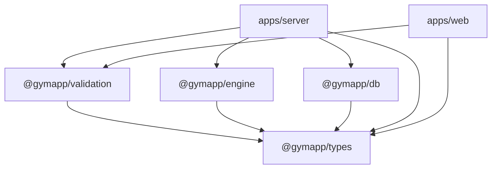

# @gymapp/types

Single source of truth for TypeScript type definitions across the Lifters Club monorepo. Zero runtime dependencies. Every package in the monorepo imports from here.

## Purpose

This package defines **domain types only** -- the shared vocabulary that all packages use to communicate. It compiles to `.d.ts` files and has no runtime cost.

## Ownership Boundary

| Owns | Does NOT own |
|------|-------------|
| Domain type definitions | Runtime validation (`@gymapp/validation`) |
| Union/literal type taxonomies | Database schema or persistence (`@gymapp/db`) |
| Interface contracts between packages | Business logic (`@gymapp/engine`) |
| Input/output shape definitions | UI component props (`apps/web`) |

## Dependency Position

Leaf node in the dependency graph. Depended on by everything, depends on nothing.



## Module Map

| File | Domain | Key Exports |
|------|--------|-------------|
| `exercise.ts` | Exercise Library | `MovementPattern` (12 patterns), `EquipmentType` (9), `MuscleGroup` (12), `Difficulty`, `Constraint`, `Exercise`, `SubstitutionQuery`, `SubstitutionResult`, `ExercisePreference`, `ExerciseAction` |
| `training.ts` | Programs & Workouts | `TrainingLevel`, `PrimaryGoal`, `UserPreferences`, `Program`, `ProgramTemplate`, `SessionTemplate`, `PlannedExercise`, `TrainingBlock`, `Workout`, `WorkoutStatus`, `WorkoutTemplate`, `WeeklyPlan`, `StandaloneWorkout`, `LoggedSet`, `WorkoutLog`, `DecisionType`, `Decision`, `DecisionOutcome`, `OverrideReason`, `DecisionOutcomeRecord`, `DecisionAccuracyStats`, `LoadDecision`, `VolumeDecision`, `RotationDecision`, `DeloadDecision` |
| `user.ts` | User Management | `User`, `CreateUserInput`, `UpdateUserInput` |
| `calibration.ts` | Onboarding | `CalibrationPath`, `BaselineMethod`, `BaselineSource`, `MaxRecentness`, `KnownMax`, `BaselineInput`, `UserBaseline`, `CalibrationExercise`, `CalibrationPlan`, `CalibrationResult` |

## Usage

```typescript
// Always use `import type` -- these are type-only exports
import type { Exercise, MovementPattern } from "@gymapp/types";
import type { LoadDecision, LoggedSet } from "@gymapp/types";
```

## How to Add a New Type

1. Identify the domain file (`exercise.ts`, `training.ts`, `user.ts`, or `calibration.ts`)
2. Add the type with JSDoc documentation explaining its purpose
3. Verify re-export -- `index.ts` uses `export *` from each domain file, so new exports are picked up automatically
4. Run `pnpm --filter @gymapp/types typecheck` to verify compilation
5. Update consuming packages if the new type changes existing interfaces

## Conventions

- **Dates**: `Date` objects in type definitions. ISO 8601 strings at API boundaries (validated by `@gymapp/validation`)
- **Use `type` for**: unions, aliases, mapped types (`type MovementPattern = "squat" | "hinge" | ...`)
- **Use `interface` for**: object shapes, contracts between packages (`interface Exercise { ... }`)
- **Input types**: suffix with `Input` (`CreateUserInput`, `ProgressionInput`)
- **Output types**: suffix with `Decision` or `Result` (`LoadDecision`, `SubstitutionResult`)
- **No runtime code**: this package has no `any`, no runtime imports, no side effects
- **No framework coupling**: types must not import from Drizzle, Zod, React, or any other library

## Verification

```bash
pnpm --filter @gymapp/types typecheck   # Verify all types compile
pnpm --filter @gymapp/types build       # Generate .d.ts files
```

TypeScript compilation IS the test suite for this package. No separate test runner needed.

## Further Reading

- [CLAUDE.md](../../CLAUDE.md) -- full monorepo coding standards
- [packages/types/CLAUDE.md](./CLAUDE.md) -- package-specific type guidelines
