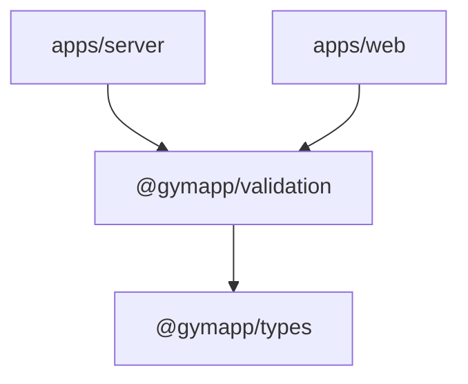

# @gymapp/validation

Zod runtime validation schemas for every system boundary in the Lifters Club monorepo. Validates API inputs on the server, form data on the web client, and provides inferred TypeScript types from schemas.

## Purpose

This package ensures data integrity at every point where untrusted input enters the system:
- **Server**: Hono route middleware via `zValidator`
- **Web**: Form validation before submission
- **Type inference**: `z.infer<typeof schema>` generates types that stay in sync with validation rules

## Ownership Boundary

| Owns | Does NOT own |
|------|-------------|
| Zod schema definitions | Domain type definitions (`@gymapp/types`) |
| Validation rules (min/max, format, constraints) | Database column constraints (`@gymapp/db`) |
| Inferred input types from schemas | Business logic rules (`@gymapp/engine`) |
| Error messages for invalid input | API error response formatting (`apps/server`) |

## Dependency Position

Depends on `@gymapp/types` for alignment. Depended on by both `apps/server` and `apps/web`.



## Module Map

| File | Key Schemas | Inferred Types |
|------|------------|----------------|
| `exercise.ts` | `movementPatternSchema`, `equipmentTypeSchema`, `muscleGroupSchema`, `difficultySchema`, `constraintSchema`, `exerciseSchema`, `createExerciseSchema`, `updateExerciseSchema`, `substitutionQuerySchema` | `ExerciseInput`, `CreateExerciseInput`, `UpdateExerciseInput`, `SubstitutionQueryInput` |
| `training.ts` | `trainingLevelSchema`, `primaryGoalSchema`, `userPreferencesSchema`, `plannedExerciseSchema`, `sessionTemplateSchema`, `programTemplateSchema`, `createProgramSchema`, `loggedSetSchema`, `createWorkoutLogSchema`, `workoutStatusSchema`, `createWorkoutTemplateSchema`, `createStandaloneWorkoutSchema`, `generateStandaloneWorkoutSchema`, `createWeeklyPlanSchema`, `updateWeeklyPlanSchema`, `generateWeeklyPlanSchema` | `UserPreferencesInput`, `PlannedExerciseInput`, `CreateProgramInput`, `LoggedSetInput`, `CreateWorkoutLogInput`, `CreateWorkoutTemplateInput`, `CreateStandaloneWorkoutInput`, `GenerateStandaloneWorkoutInput`, `CreateWeeklyPlanInput`, `GenerateWeeklyPlanInput` |
| `user.ts` | `createUserSchema`, `updateUserSchema` | `CreateUserSchemaInput`, `UpdateUserSchemaInput` |

## Usage Examples

### Server: Hono zValidator middleware

```typescript
import { zValidator } from "@hono/zod-validator";
import { createExerciseSchema } from "@gymapp/validation";

app.post(
  "/exercises",
  zValidator("json", createExerciseSchema),
  async (c) => {
    const data = c.req.valid("json"); // Fully typed as CreateExerciseInput
    // ...
  }
);
```

### Web: Form validation with safeParse

```typescript
import { createUserSchema } from "@gymapp/validation";

function handleSubmit(formData: unknown) {
  const result = createUserSchema.safeParse(formData);

  if (!result.success) {
    // result.error.issues contains field-level errors
    return { errors: result.error.flatten().fieldErrors };
  }

  // result.data is fully typed as CreateUserSchemaInput
  await submitToApi(result.data);
}
```

### Type inference

```typescript
import type { z } from "zod";
import { loggedSetSchema } from "@gymapp/validation";

// Inferred type stays in sync with the schema automatically
type LoggedSetInput = z.infer<typeof loggedSetSchema>;
```

## How to Add a Schema

1. Define the schema in the appropriate domain file (`exercise.ts`, `training.ts`, or `user.ts`)
2. Export the inferred type: `export type MyInput = z.infer<typeof mySchema>;`
3. Re-export from `index.ts` if the domain file is already re-exported (it is -- `index.ts` uses `export *`)
4. Use the schema in the consuming route or form
5. Run `pnpm --filter @gymapp/validation typecheck` to verify

## Conventions

- **Schema naming**: `{noun}Schema` for base schemas, `create{Noun}Schema` / `update{Noun}Schema` for action variants
- **Schemas mirror `@gymapp/types`**: enum schemas match the union types defined in the types package exactly
- **Dates at API boundary**: validated as ISO 8601 strings (`z.string().regex(/^\d{4}-\d{2}-\d{2}$/)`), converted to `Date` objects in application code
- **Partial updates**: use `.partial()` for update schemas, `.omit({ id: true })` for create schemas
- **Refinements**: use `.refine()` for cross-field validation (e.g., "template name required when saving as template")

## Further Reading

- [CLAUDE.md](../../CLAUDE.md) -- full monorepo coding standards
- [packages/validation/CLAUDE.md](./CLAUDE.md) -- package-specific validation guidelines, composition patterns, and testing examples
- [Zod Documentation](https://zod.dev)
